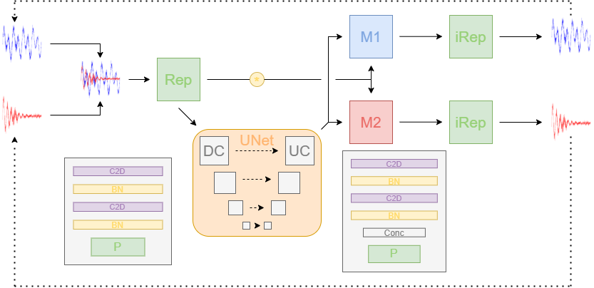

# BioCPPNet: Automatic Bioacoustic Source Separation with Deep Neural Networks



## Peter C. Bermant
In our recent [paper](https://www.biorxiv.org/content/10.1101/2021.06.18.449016v1), we propose the Bioacoustic Cocktail Party Problem (BioCPPNet), a modular and lightweight convolutional neural network-based architecture optimized for bioacoustic source separation across heterogeneous non-human vocal behavior. The model is trained to separate input waveforms containing signal mixtures into source estimates using a permutation-invariant training criterion, and we implement an objective function related to perceptual quality of the reconstructed signals.

We evaluate the performance of ESRepUNet using objective metrics such as the scale-invariant signal-to-distortion ratio (SI-SDR) and downstream classification accuracy in addition to qualitative metrics based on visual and aural representations of the source predictions.

To our knowledge, BioCPPNet redefines the state-of-the-art in end-to-end single-channel bioacoustic source separation in a permutation-invariant regime across a heterogeneous set of animal species


## Setup
1. Clone the repo
```command
git clone https://github.com/earthspecies/cocktail-party-problem.git
```
2. Install the requirements
```command
pip install -r requirements.txt
```

## Pipeline

1. Download the bioacoustic datasets into a directory `BioacousticData/`

2. Generate the config.json file containing the configurations for constructing datasets, building and training models, and evaluating model performance 

   ```command
   python ConfigGenerator.py --animal Animal --file config.json
   ```

   where `Animal` is the particular animal of interest (in our case, `Macaque`,  `Dolphin`, or `Bat`).

3. Generate the datasets for training and evaluating the classifier and separator models

   ```command
   python DataGenerator.py --animal Animal --data_directory Data --config config.json --os Ubuntu --objective Classification --regime Closed
   ```

   ```command
   python DataGenerator.py --animal Animal --data_directory Data --config config.json --os Ubuntu --objective Separation --regime Closed
   ```
	
	We can also consider the open speaker regime in which the evaluation subset contains calls generated by individuals not included in the training distribution
	
   ```command
   python DataGenerator.py --animal Animal --data_directory Data --config config.json --os Ubuntu --objective Separation --regime Open
   ```
4. Train the classifier model, which is used to evaluate the performance of the separator model on a downstream task

   ```command
	python Classifier.py --animal Animal --data Data --config config.json
   ```

5. Train the separator model including a classifier to evaluate performance as well as the classifier's testing accuracy to account for the probabilistic nature of classifying biacoustic signals and the stochasticity of the classifier model

   ```command
	python Separator.py --animal Animal --data Data --config config.json -classifier_name classifier_name --classifier_peak_acc classifier_peak_acc --regime Closed
   ```

6. Evaluate the performance in the appropriate regime, for example the `Open` regime

   ```command
	python Evaluate.py --animal Animal --data Data --config config.json --separator_name separator_name --classifier_name classifier_name --classifier_peak_acc classifier_peak_acc --regime Open
   ```
 
We provide an interactive Colab notebook to visualize spectrograms and listen to separated signals.
