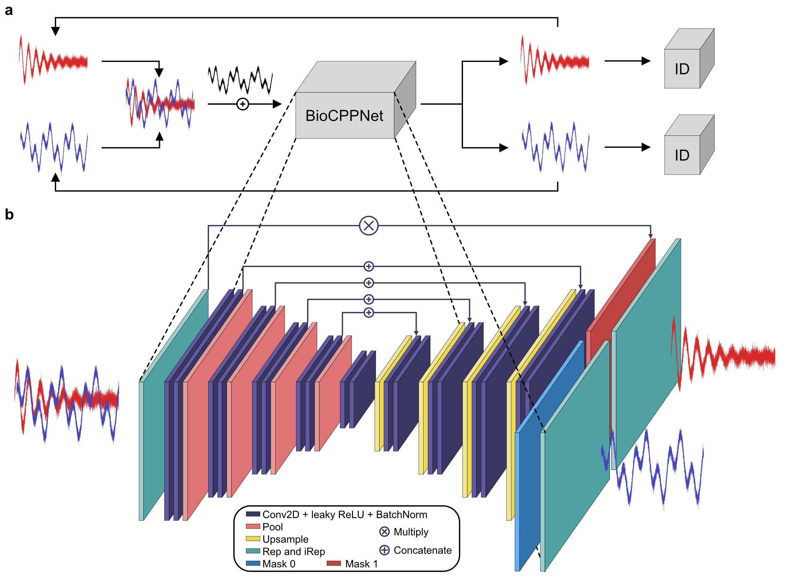
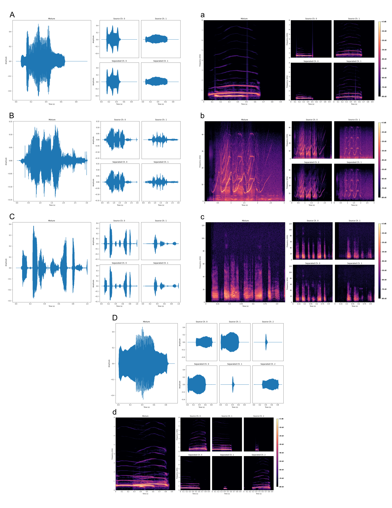

# BioCPPNet: Automatic Bioacoustic Source Separation with Deep Neural Networks



In our recent [paper](https://www.nature.com/articles/s41598-021-02790-2), we propose the Bioacoustic Cocktail Party Problem Network (BioCPPNet), a modular and lightweight convolutional neural network-based architecture optimized for bioacoustic source separation. To our knowledge, this paper redefines the state-of-the-art in single-channel bioacoustic source separation across a diverse set of non-human animal species.

Employing a custom deep neural network architecture, the BioCPPNet, we separate acoustic mixtures containing overlapping calls into predictions of the disentangled sources. We train the model using a permutation-invariant training (PIT) criterion as is common in the human speech separation literature, and we use an objective training function motivated by the perceptual audio quality of the reconstructed signals. We apply our methods to a range of animals, including macaques, bottlenose dolphins, and Egyptian fruit bats. We assess the performance of the framework using quantitative metrics including the scale-invariant signal-to-distortion ratio (SI-SDR) and downstream identify classification accuracy.

As part of this study, we also report state-of-the-art improvements in bioacoustic classification tasks, i.e. labeling the identity of the animal responsible for generating a given vocalization. For instance, our macaque classifier model achieves 99.3% accuracy across 8 individuals and maintains an accuracy of 93.7%, even after calls are mixed and separated.

We specifically design our technique to address the technical and logistical challenges of working in the bioacoustic domain, which include limited data availability, unique vocal behavior requiring computationally expensive high sampling rates, and uncertainty in representing bioacoustic signals, among others. BioCPPNet serves as a general pipeline for bioacoustic source separation that performs well across a distribution of non-human acoustic signals. 

We believe that this study has broad scientific interest, as it implements cutting edge machine learning techniques to open the door to accessing large quantities of previously unusable bioacoustic data containing overlapping vocalizations. This will have important implications for future research, since increased access to larger bioacoustic datasets can empower the scientific community to address a greater quantity of more complex research questions, which can facilitate the development of improved conservation and management strategies for the earth’s non-human species.



## Setup
1. Clone the repo
```command
git clone https://github.com/earthspecies/cocktail-party-problem.git
```
2. Install the requirements
```command
pip install -r requirements.txt
```

## Pipeline

1. Download the bioacoustic datasets into a root directory `BioacousticData/', naming the downloaded dataset folder 'AnimalName/'. Note that the DataHelpers.py and DataGenerator.py scripts do not require the macaque dataset to be downloaded locally before proceeding with the following steps.

2. Generate the config.json file containing the configurations for constructing datasets, building and training models, and evaluating model performance 

   ```command
   python ConfigGenerator.py --animal Animal --file config.json
   ```

   where `Animal` is the particular animal of interest (in our case, `Macaque`,  `Dolphin`, or `Bat`).

3. Generate the datasets for training and evaluating the classifier and separator models

   ```command
   python DataGenerator.py --animal Animal --data_directory Data --config config.json --os Ubuntu --objective Classification --regime Closed
   ```

   ```command
   python DataGenerator.py --animal Animal --data_directory Data --config config.json --os Ubuntu --objective Separation --regime Closed
   ```
	
	We can also consider the open speaker regime in which the evaluation subset contains calls generated by individuals not included in the training distribution
	
   ```command
   python DataGenerator.py --animal Animal --data_directory Data --config config.json --os Ubuntu --objective Separation --regime Open
   ```
4. Train the classifier model, which is used to evaluate the performance of the separator model on a downstream task

   ```command
	python Classifier.py --animal Animal --data Data --config config.json
   ```

5. Train the separator model including a classifier to evaluate performance as well as the classifier's testing accuracy to account for the probabilistic nature of classifying biacoustic signals and the stochasticity of the classifier model

   ```command
	python Separator.py --animal Animal --data Data --config config.json --classifier_name classifier_name --classifier_peak_acc classifier_peak_acc --regime Closed
   ```

6. Evaluate the performance in the appropriate regime, for example the `Open` regime

   ```command
	python Evaluate.py --animal Animal --data Data --config config.json --separator_name separator_name --classifier_name classifier_name --classifier_peak_acc classifier_peak_acc --regime Open
   ```

## Acknowledgements
We thank Laela Sayigh, Frants Jensen, Michelle Fournet, Andrés Babino, Maddie Cusimano,and James Crutchfield for reviewing the manuscript and Steve Vassallo, Stefan Thomas, Evan Sharp, Munjal Shah, Shiva Ranjaram, Meghan Railey, Alex Payne, Chris Larsen, Mike Kreiger, Nicole Brodeur, and Scott Belsky for their invaluable support.
